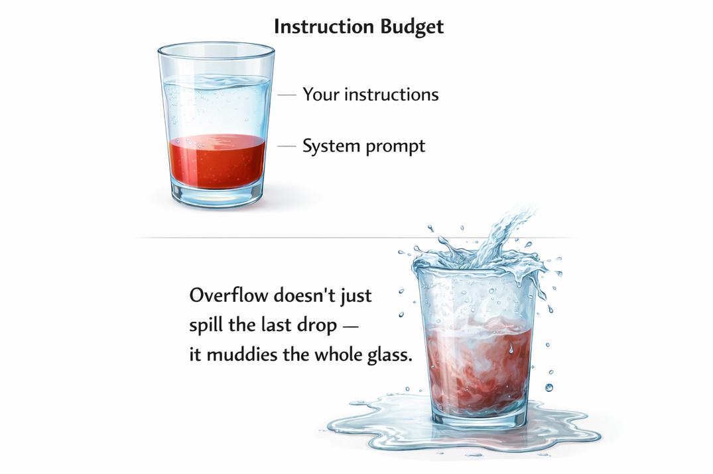

Last month I watched a coding agent completely ignore a rule I'd spent 20 minutes writing. The rule was clear, specific, well-formatted. And the agent just… didn't follow it.

So I did what any reasonable person would do: I added _more_ rules. Made the file longer. Covered more edge cases.

Little did I know that made things worse.

It took me an embarrassing amount of time to figure out why. The answer, once I found it, changed how I approach agent instructions.

## Your agent has an attention budget, and you're blowing it

CLAUDE.md, Cursor rules, copilot-instructions.md, Junie Guidelines, AGENTS.md, Agent Skills. Different names, same destination: the model's context window.

That includes modular skill files too. When a skill activates, its
instructions land in the same context window alongside your root file.
Everything in this post applies to both.

Yes, modern models support massive context lengths. That's not the same as reliably using everything you stuff into them.

Two limits matter:

**Token length:** how much text fits in the window.

**Effective attention:** how reliably the model uses what you gave it.

[Research has shown reasoning performance can degrade as prompts grow into the low thousands of tokens](https://arxiv.org/pdf/2402.14848), well before you hit the technical context limit. And practitioners repeatedly report the same pattern: once instruction files get long, adherence becomes unreliable, often in ways that look random.

Here's what that feels like in practice:

You add one more rule.

The model doesn't just ignore the new one. It starts randomly ignoring rules across the board, different ones each time.



Think of your instruction file like selling ad space. Every line has to justify its rent. If a rule can't point to a real failure it prevented, it's probably noise.

The most effective instruction files I've seen in production are surprisingly small. The AGENTS.md in our IntelliJ monorepository for instance is just 6KB, roughly 120 lines in total for a codebase with millions of lines of code.

When looking at the rules of my side project...roughly five times the size. Most of it was making things worse.

## What my instructions looked like before and after

Here's a simplified version of the "before" file:

```markdown
# Project Instructions

## Code Style

- Use 2-space indentation
- Use single quotes for strings
- Always use trailing commas
- Use arrow functions over function declarations
- Prefer const over let, never use var
- Use template literals over string concatenation
- Import order: external libs, then internal modules, then relative imports
- Always add JSDoc comments to public functions
- Use PascalCase for components, camelCase for functions
- Always destructure props in function signature

## Architecture

- This is a React 18 app with TypeScript 5.3 and Vite 5
- We use Tailwind CSS 4 for styling
- State management: Zustand for global, React state for local
- API calls go through src/api/ using a custom fetch wrapper
- All forms use react-hook-form with zod validation
- Authentication uses JWT tokens stored in httpOnly cookies
- The app supports i18n via react-i18next
- Routing is handled by react-router v6 with lazy loading
- We use Vitest for unit tests and Playwright for e2e
- Error boundaries wrap each route segment
- ... (30 more lines)

## Testing

- Write unit tests for all utility functions
- Use Testing Library for component tests
- Mock API calls using msw
- Aim for 80% coverage
- Test error states and loading states
- Use data-testid attributes for e2e selectors

## Git

- Use conventional commits
- Always create feature branches
- Squash merge into main
- ... (15 more lines)
```

Responsible? Sure.

Effective? Not really.

Here's what replaced it:

```markdown
# Project

React 18, TypeScript 5.3, Vite 5, Tailwind CSS 4. Zustand for global state.

Key dirs: src/api/ (fetch wrapper), src/features/ (domain modules),
src/components/ (shared UI).

## Verification

- Tests: `npx vitest run --reporter=verbose`
- Types: `npx tsc --noEmit`
- Lint: `npx eslint src/ --fix`
- E2E: `npx playwright test --project=chromium`

Run verification after every change. Fix issues before moving on.

## Permissions

Ask first: new dependencies, schema changes, CI config changes.
Never: commit .env files, edit node_modules, push to main, delete data.

## Gotchas

- Auth: use `refreshToken()` not `getNewToken()`. `getNewToken()` bypasses
  the rate limiter and causes 429s in prod.
- DB migrations: run `migrate:check` before `migrate:run`. The check
  validates FK constraints that `migrate:run` silently skips.
- Vitest: use `vi.useFakeTimers()` in beforeEach, not at module level.
  Module-level fake timers break msw request interception.

When working on auth flows (401 loops, TokenExpiredError, refresh logic), read docs/auth-flow.md.

When modifying API clients or error handling, read docs/api-patterns.md.
```

Thirty lines. Dramatically better behavior.

> This goes for skills too. They stack on top of your base instructions,
> so brevity matters even more inside them. The pruning rubric below
> works the same way.

Here's why.

## The principles behind the rewrite

### 1. Give your agent a feedback loop, not a rulebook

The biggest upgrade wasn't architectural guidance. It was verification commands.

Instead of telling the model how to write perfect code, I told it how to check its work.

Agents are good at iteration. When they can run tests, see type errors, fix lint failures, and repeat, quality jumps. You're not trying to pre-encode perfection. You're giving them a tight feedback loop.

If your tool supports hooks, use them. I run Prettier automatically after file edits. That handles formatting without burning instruction space.

Which brings us to the next rule.

### 2. Never send an LLM to do a linter's job

Every formatting rule in my old file was already enforced by ESLint or Prettier.

LLMs are in-context learners. They already mimic your codebase patterns. The remaining 10% of style consistency? Let deterministic tools enforce it.

This applies broadly:

| Concern             | Tool              |
| ------------------- | ----------------- |
| Formatting          | formatter         |
| Types               | type checker      |
| Schemas             | schema validation |
| Coverage thresholds | CI                |

Reserve your instruction space for what tools can't handle: judgment calls, domain context, and known failure modes.

One caveat: keep hooks lightweight. Each hook execution that modifies files adds output the agent might has to re-read — in a large refactor, that compounds quickly. Scope them to the file being edited, not the whole project.

### 3. Document your failures, not your aspirations

The "Gotchas" section is the most valuable part of the file.

Every line came from a real mistake.

`getNewToken()` cost me two hours debugging rate limits. Fake timers at module scope broke CI repeatedly before I traced the msw interaction.

That's what belongs in your root instruction file.

If you solve a painful bug with the agent, ask it to summarize what went wrong and how it was fixed. Turn that into a one-liner. Your file improves every time something breaks.

### 4. Use this pruning rubric

If you want a concrete way to cut your file down, use this:

For each line, ask:

**Failure-backed:** Did this prevent a real issue in the last 30 days?

**Tool-enforceable:** Could a linter, type checker, or CLI handle this instead?

**Decision-encoding:** Does this capture domain judgment or architectural intent?

**Triggerable:** Does it include a condition or command, not just a value statement?

If it fails all four, delete it. You don't need that baggage, and neither does your context window.

### 5. Use progressive disclosure (with triggers)

Don't load everything up front.

Instead, point to deeper docs and tell the agent _when_ to read them.

Bad:

```
See docs/auth-flow.md
```

Better:

```
When working on auth flows (401 loops, TokenExpiredError, refresh logic), read docs/auth-flow.md.
```

Even better:

```
If you encounter TokenExpiredError or 401 retry loops,
read docs/auth-flow.md before changing refresh logic.
```

That's progressive disclosure: short root file, deeper context on demand.

Some ecosystems are formalizing this idea. There are emerging standards like Agent Skills (modular, executable skill packages) and AGENTS.md (project-level context files) that multiple tools can read. You don't need to bet on a winner yet, just structure your instructions so they're modular and trigger-based.

### 6. Set clear permission boundaries

The permissions block has two tiers: **Ask first** and **Never**.

- **Ask first:** things the agent must pause and confirm with you before doing: adding a new dependency, changing the schema, touching CI config.
- **Never:** hard limits it must not cross regardless of context: committing `.env` files, editing `node_modules`, pushing to main.

You might wonder why there's no "Always" tier. There doesn't need to be, e.g. "Run verification after every change" already lives in the Verification section. Repeating it under Permissions would be redundant. Keep this section focused purely on boundaries.

Some rules feel obvious. "Never commit secrets" is one of them. Write it down anyway. Agents follow what's written, not what you meant.

If a rule doesn't fit cleanly into "Ask first" or "Never," it's probably too nuanced for the root file. Link to a deeper doc with a trigger condition instead.

## When longer instructions do make sense

There are exceptions.

Highly regulated environments. Security-sensitive systems. Platform teams managing shared infra across many repos.

In those cases, you may need more explicit guardrails.

But even then:

- Keep the root file small.
- Push detail into linked documents.
- Use triggers.
- Prefer tooling over prose.

Length should be the last resort and expect your agent to make mistakes.

## Anti-patterns I keep seeing

| What people write                      | What works better                                                       |
| -------------------------------------- | ----------------------------------------------------------------------- |
| "Follow clean code principles."        | Code Quality tools with strict rules                                    |
| "Make sure the code is well-tested."   | "Run `npx vitest run`. Fix failures before moving on."                  |
| "Never use the `--force` flag."        | "Never use `--force`. If a push is rejected, pull and rebase manually." |
| "Improve performance."                 | "Profile with `npx clinic doctor`. Target functions over 100ms."        |
| "Be careful with database operations." | "Ask before: schema changes, bulk deletes, index modifications."        |

Vague rules force the model to guess. Specific rules get followed.

Another subtle anti-pattern: auto-generated instruction files you never edited. Treat them as scaffolding. Prune aggressively. Replace generic advice with your project's real failure modes.

## The checklist

Open your instruction file and ask for each line:

"Did removing this ever cause a real problem?"

If the answer is no, cut it.

Then:

- [ ] Add exact verification commands.
- [ ] Remove anything your tooling already enforces.
- [ ] Add a gotchas section.
- [ ] Define Ask First / Never boundaries.
- [ ] Move anything longer than a paragraph into a linked file with a trigger condition.

Then start a fresh agent session.

You'll probably notice the difference immediately.
