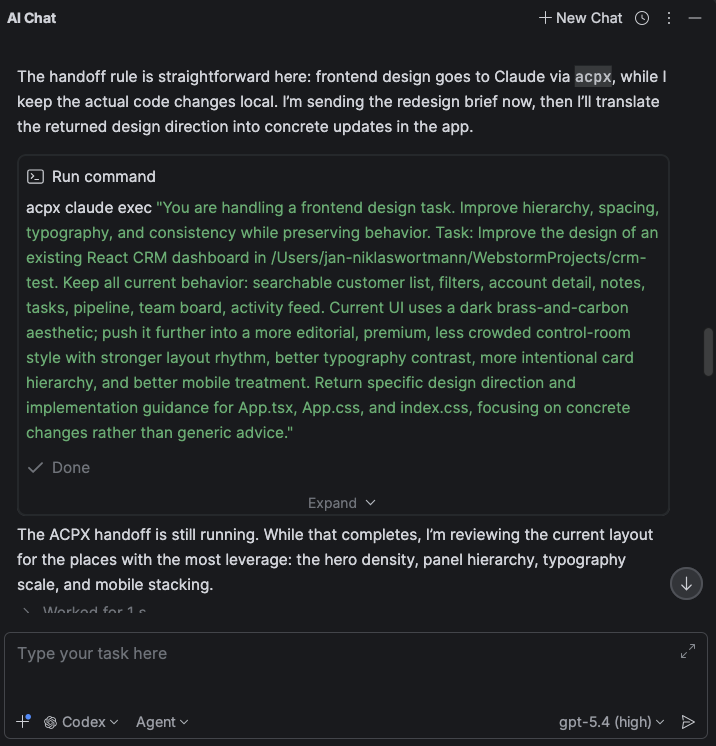

_How I use ACPX to route development tasks when my default AI agent isn’t the right fit._

Most developers eventually settle on one **default AI coding agent**.

Once you find a setup that works, you stop wanting to bounce between tools all day. The friction adds up quickly, and consistency matters.
Right now my default is **Codex with GPT-5.4 inside JetBrains IDEs**. It handles most of my day-to-day development work well: debugging, refactoring, wiring features, and making edits across the repository.
But after working with AI agents daily, I started noticing a pattern: many developers gradually try to force one agent to do everything.

That’s usually where workflows begin to break down.

> Your preferred coding agent should stay your default.  
> It shouldn’t become your solution for every kind of task.

Or, as the saying goes:

> If the only tool you have is a hammer, everything starts looking like a nail.

Instead of forcing one agent to handle every task, I use **ACPX as a routing layer** when something falls outside the strengths of my default setup.

**[ACPX](https://github.com/openclaw/acpx)** is a lightweight routing layer that lets me hand off tasks to different AI agents while staying inside my development workflow using the Agent Client Protocol (ACP).

A good example is **frontend design work**. Agents in general are notoriously bad at frontend design. In my opinion Claude Code with Opus 4.6 handles it the best,
so I like to use it for design-heavy tasks. That's where ACPX comes into play.

## The mistake I see developers make

Most developers start with a single AI coding tool and gradually push more and more work through it and at first this works well.
But eventually the work stops being purely implementation.

There’s a real difference between tasks like:

- fixing a bug
- refactoring a service
- generating tests

and work such as:

- redesigning a cramped dashboard
- improving visual hierarchy on a settings page
- making a product UI feel more intentional

These tasks involve **different kinds of reasoning**.
Implementation work rewards precision and repository awareness. Design work relies more on taste, visual judgment, and stronger opinions about layout and hierarchy.

Yet most AI workflows treat them as if they should all go through the same agent.
That’s where friction starts to appear. Prompts get longer and noticeably more frustrated, results become less satisfying, and developers begin trying to **prompt their way through it**.

## My workflow

My setup is intentionally simple: **a default agent with explicit handoffs**.

- **Default agent:** Codex with GPT-5.4 in JetBrains
- **Routing layer:** ACPX
- **Design-heavy tasks:** Claude Opus via Claude Code with a frontend design skill

The important detail is that I don’t make every handoff manually.

I use an **agent skill** with Codex that instructs it to call ACPX when a task falls into certain categories. Practically speaking, that means I can stay in the same chat and the same IDE workflow while Codex decides when to hand a task off to a different agent.

If you want to see the exact setup, here’s the skill I [created](https://github.com/niklas-wortmann/acpx-handoff-skill) (could maybe still use some tweaking), but ACPX also comes with a [skill](https://github.com/openclaw/acpx?tab=readme-ov-file#quick-setup--tell-your-agent-about-acpx) that can be handy.

Instead of complicated routing logic, I follow a single rule:

> If the task requires design judgment → route it to Claude Opus  
> Otherwise → keep it with Codex

This keeps the workflow simple enough that I don’t have to think about it.

## Where routing actually helps

The handoff becomes useful when prompts start sounding like:

- “Make this dashboard feel less crowded.”
- “This works, but it still looks like an internal tool.”
- “Keep the functionality, but polish the UI.”

These prompts aren’t just asking for code. They’re asking for **design judgment**.
They involve decisions about layout balance, spacing rhythm, component hierarchy, visual density, and typography and just generally taste.
That’s exactly where the skill becomes useful. Instead of trying to force Codex to handle a task that mostly needs taste and stronger visual judgment, I let it use ACPX to route the request to Claude Code and let Opus 4.6 take care of it.
The difference is usually noticeable. My default coding agent tends to produce **technically correct UI edits** that look a little bit like a Windows XP application, while Claude Code is more likely to **rethink the layout itself** and reorganizing components, adjusting hierarchy, and making stronger visual decisions.

If I want something to look halfway decent, that does difference matters, but Codex still remains my main development tool.

## Why ACPX fits well here

Switching agents is annoying, and usually I see developers stop doing it entirely missing out on exploring and utilizing the various agent capabilities.
ACPX keeps such a transition lightweight, which means I can stay inside my normal development workflow while still routing specialized tasks when they actually benefit from a different agent.

## What improved when I started routing design work

### Stronger opinions

Design work benefits from models that make clear decisions about layout, spacing, and hierarchy.
Agents in general are still not great at frontend design work, but in my opinion Claude Code with Opus 4.6 is the best at it.

### Fewer rescue prompts

When the wrong agent handles a task, prompts often get longer as you try to compensate.
You end up writing paragraphs of instructions to guide the model toward the result you want. Often the problem isn’t the prompt itself.
It’s rather using the wrong tool for the job.

Routing the task usually solves the problem more cleanly and often faster.

## The pattern is bigger than frontend work

Frontend design is just the most obvious example from my workflow.
What I want you to take away from this blog post:
Instead of asking:

> “Which AI model is best?”

Developers should start asking:

> “Which model/agent is best for this type of work inside my workflow?”

That leads to a much more practical setup:

- one **default agent** for daily development
- a few **explicit handoff rules**
- specialized paths where they actually help

## A simple way to apply this yourself

You don’t need to copy my exact stack.

A simple approach looks like this:

1. **Pick your default agent**

Choose the tool that handles most of your development work.

2. **Notice where it struggles**

Look for tasks where prompts become awkward or results require multiple retries.

3. **Define one handoff rule**

Route that category of work to another model or agent.
That category might be frontend design, documentation writing, architecture exploration, test review, or security analysis.

The important part isn’t the tool choice.
It’s making the **handoff explicit**.

## My rule of thumb

In my workflow the distinction is straightforward.

Stay with the default when the work needs:

- implementation precision
- repository awareness
- debugging discipline
- careful incremental edits

Route the task when it needs:

- design judgment
- broader reframing
- stronger taste
- more opinionated output

That single distinction has been more useful to me than most benchmarks and model comparison discussions.

## Why I keep using ACPX

I don’t use ACPX because I want a more complicated stack.
I use it because it lets me keep the workflow I like while covering the areas where it’s weaker.
If you already have a preferred coding agent, that’s how I think about ACPX:

Not as a replacement. But as a flexible way to keep your default while making smarter decisions when the nature of the work changes.
