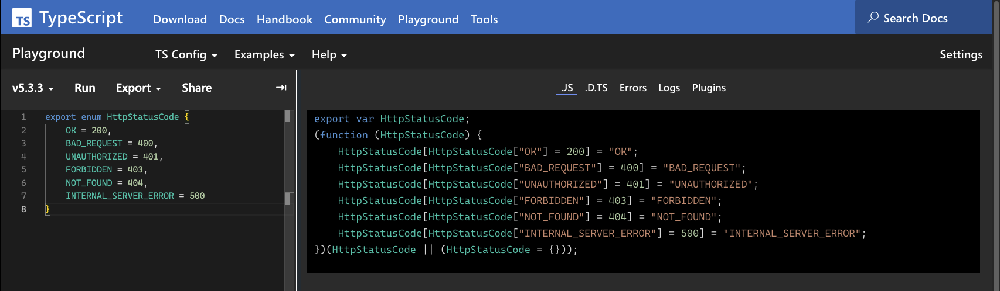
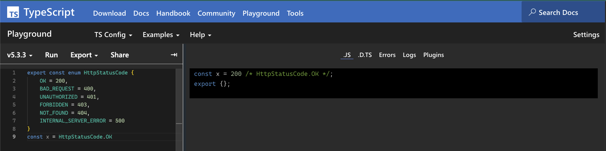

# Why you shouldn't use Enums!

TypeScript `Enums` is a feature that gets way more love from the community than it actually deserves. While TypeScript 5 improved some of my original concerns,
`Enums` are still having one major issue... There is no JavaScript concept of an `Enum`. This doesn't sound like a big deal, right? Wrong! Let's take a closer look
at the issues and how to fix enums!

## The Problem

Alright `Enums`don't exist in JavaScript, what's the big deal, right?! We all heard that statement 'TypeScript is a superset of JavaScript', so why shouldn't
that superset add features to JavaScript. Well ... let me tell you the story of `experimentalDecorators`. In times not too long ago, there was just a TypeScript
poor little compiler flag called `experimentalDecorators`. This flag was trying to act and behave like his big brother the TC39 `Decorator` Proposal.
But unfortunately the `Decorator` proposal wasn’t all grown up yet, so as it happens to brothers, they grow apart. End of the story. TypeScript introduced Decorators,
modeled after the TC39 proposal as it was at that time, but it happened that the proposal changed while the experimentalDecorator feature is used and therefore can't easily
be changed.
To cope with the fact that there is not an enum construct in JavaScript, TypeScript came up with a clever trick.



A little simplified but basically TypeScript creates an Object that looks like this

```ts
export const HttpStatusCode = {
    OK: 200,
    BAD_REQUEST: 400,
    UNAUTHORIZED: 401,
    FORBIDDEN: 403,
    NOT_FOUND: 404,
    INTERNAL_SERVER_ERROR: 500,
    200: "OK",
    400: "BAD_REQUEST",
    403: "FORBIDDEN",
    404: "NOT_FOUND",
    500: "INTERNAL_SERVER_ERROR"
};
```

The nice thing with this approach is that is let's us have access to every possible information of the `HttpStatusCode` in a biderectional way. We can get results by
calling `HttpStatusCode["OK"]` & `HttpStatusCode[200]`. From a developer experience this is nice and opens the door for a lot of different ways to get access to these informations,
but it does come an increase in bundle size. That bundle size might be negligble, but it can easily add up, just imagine if I would have added all possible values
to my `HttpStatusCode` Enum, I just picked some common one, but just have a quick look at the [https://en.wikipedia.org/wiki/List_of_HTTP_status_codes](full%20list), and it should give you a rough impression what it does
to your bundle size.
There are applications out there, where bundle size is not a concern at all, but I still have a problem with this approach. It breaks the distinct line between TypeScript and JavaScript.
There is one fix to that problem, `const enums` in TypeScript don't create any code at runtime, they just act as a type and their value is automatically resolved when used.



[//]: # (https://www.typescriptlang.org/play?#code/KYDwDg9gTgLgBAYwgOwM72MgrgWzgCRhjAGUYBDGLVAYQgBNg4BvAKDg7gHkBpOAXjgAmAAwiANO04AhAIIARAPoAlAKIBFAKqqSAFQFwALGMmc4mgHKzNu-F2UBJAFqr5B4wEZTnAGL3pDvLyqhbuIgDM3hwWXLqKfpZugsaGUXAOFrqqylYAMook2QBq2YrZyvYGAKxirAC+rEho8CAGhMRklNR0jAB0vEA)

The result of this looks great to me, but you can run into problems with this.
It is getting more and more common to use other transpilers to generate JavaScript code from TypeScript.
Often those transpilers work on a file-by-file basis,
transpiling just a single file without fully understanding the full type system.
[Vite](https://vitejs.dev/) and [Babel](https://babeljs.io/) work this way for instance.
Just transpiling a single file does not read imported modules, so there is no way to support `const enums`.

## The Solution

Well first and foremost don't use enums!
TypeScript has Literal Types that are a great replacement for enums.
Literal Types in TypeScript can be used for strings and numbers (and booleans but less relevant for this blog post) and the best thing is: those are type safe.
Alright, here's how using literal types for our `HttpStatusCode` enum could look like this:

```ts twoslash
export const HttpStatusCode_OK = 200;
export const HttpStatusCode_BAD_REQUEST = 400;
export const HttpStatusCode_UNAUTHORIZED = 401;
export const HttpStatusCode_FORBIDDEN = 403;
export const HttpStatusCode_NOT_FOUND = 404;
export const HttpStatusCode_INTERNAL_SERVER_ERROR = 500;

export const ALL_HTTP_STATUS_CODES = [
  HttpStatusCode_OK,
  HttpStatusCode_BAD_REQUEST,
  HttpStatusCode_UNAUTHORIZED,
  HttpStatusCode_FORBIDDEN,
  HttpStatusCode_NOT_FOUND,
  HttpStatusCode_INTERNAL_SERVER_ERROR,
] as const;

export type HttpStatusCodes = typeof ALL_HTTP_STATUS_CODES[number]
```

This is a pattern I mostly use for this purpose.
It doesn’t support the bidirectional-access of enums, but this is something I rarely use and could be accomplished via copy paste.
It also works the same way with strings instead of numbers.
This approach doesn't come with footguns and is pretty straightforward.
I also like the type safety of it.

```ts
const someFn = (someValue: HttpStatusCodes) => {...}

someFn(200); // This Works ✅
someFn(HttpStatusCode_OK); // This Works too ✅
someFn(300); // Does not work ❌
```

## Helpful Utilities

The TypeScript [`isolatedModules`](https://www.typescriptlang.org/tsconfig#isolatedModules) provides warning for certain scenarios where file-by-file transpilation can cause runtime errors.
This mostly addresses issues when using a `const enum`.
[Nicholas Jamieson](https://ncjamieson.com/) wrote an eslint plugin called [eslint-plugin-etc](https://www.npmjs.com/package/eslint-plugin-etc) which has a `no-enum` and `no-const-enum` rule, which is perfect to prevent errors like the ones above! 

